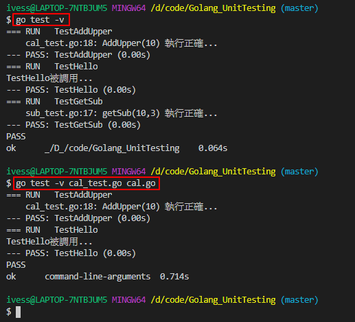
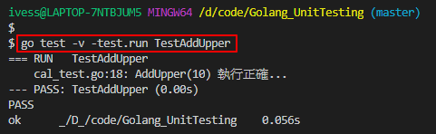
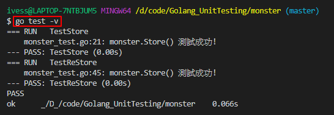

# Golang_UnitTesting

# 單元測試

> 使用testing框架

- 測試用例文件名必須以 _test.go 結尾，比如 cal_test.go， cal 不是固定的。
- 測試用例必須以Test開頭，一般來說就是Test+被測試的函數名，比如TestAddUpper(AddUpper第一字要大寫，即使原函數名該字母為小寫)。
- TestAddUpper(t *testing.T)的形參類型必須是 *testing.T。
- 一個測試用例文件中，可以有多個測試用例函數，比如TestAddUpper、TestSub
- 當出現錯誤時，可以使用t.Fatalf來格式化輸出錯誤訊息，並退出程序
- t.Logf方法可以輸出相應的日誌

test框架將cal_test.go的文件引入 -> cal_test.go對cal.go的函數進行測試 -> cal.go


例如待測檔名為cal.go，該測試的文件即取名cal_test

```shell
# 運行測試用例指令

# 如果運行正確無日誌，錯誤時會輸出日誌
go test 

# 運行無論正確或錯誤，都會輸出日誌
go test -v

# 單獨測一個文件
go test -v cal_test.go cal.go

# 單獨測試一個函數
go test -v -test.run TestAddUpper
```





# 單元測試綜合案例要求

- 編寫一個Monster結構體，字段Name、Age、Skill
- 給Monster綁定方法Store，可以將一個Monster變量(對象)，序列化後保存到文件中
- 給Monster綁定方法ReStore，可以將一個序列化的Monster，從文件中讀取，並反序列化為Monster對象，檢查反序列化，名字正確
- 編程測試用例文件store_test.go，編寫測試用例函數TestStore和TestRestore進行測試。

程式在monster資料夾下的monster.go、monster_test.go




